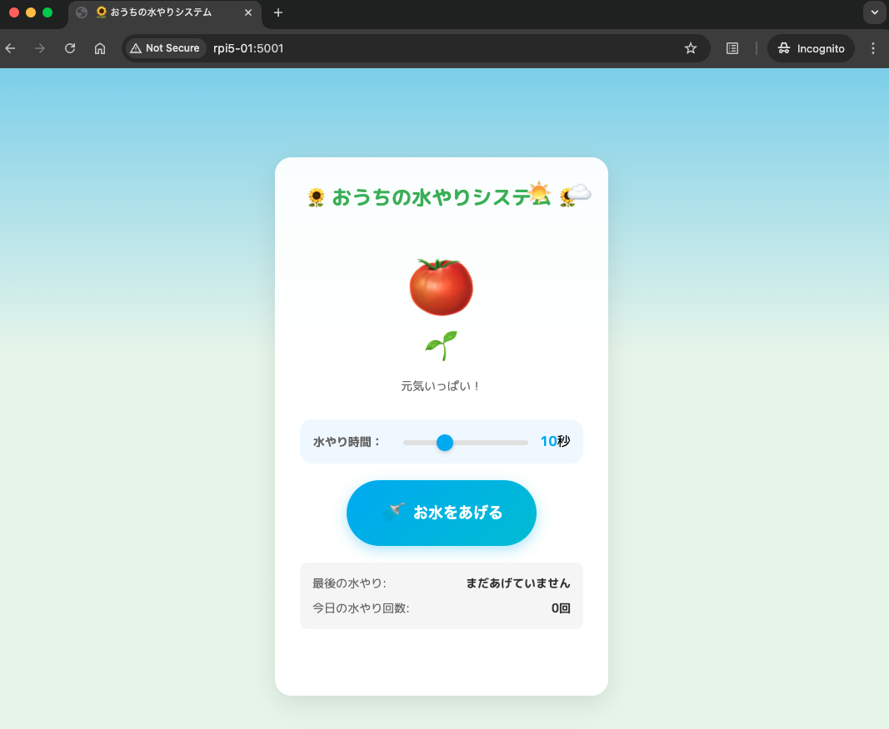

# 🌱 Water Supply System

## 1. 概要
ESP32を使用したガーデニング水やりシステムのWebコントローラー。ESP32側で水やり制御を行い、WebアプリケーションからHTTP APIで制御する分散構成。



直感的なWebインターフェースで水やり時間を設定し、ESP32経由で水やりを実行できます。

## 2. システム構成

### 2.1 アーキテクチャ
- **ESP32**: 水やり制御（リレー制御、水やり実行）
- **Web Controller**: FlaskアプリケーションによるWeb UI + REST API

### 2.2 通信方式
- ESP32とWebコントローラー間はHTTP API通信
- WebコントローラーからESP32の `/water` エンドポイントにリクエスト送信

## 3. ディレクトリ構造
```
water-supply-system/
├── esp32.ino               # ESP32用水やり制御プログラム（リファレンス実装）
├── compose.yml
├── Dockerfile
├── .env
├── app/
│   ├── app.py              # Flaskアプリケーション（ESP32 APIクライアント）
│   ├── requirements.txt
│   ├── static/
│   │   ├── css/
│   │   │   └── style.css
│   │   └── js/
│   │       └── app.js
│   └── templates/
│       └── index.html
├── web-ui-screenshot.png   # WebUI画面キャプチャ
└── README.md
```

## 4. 設定

### 4.1 環境変数設定（.env）
```env
# ESP32のAPIベースURL（必須）
WATERING_API_BASE_URL=http://esp32.local.wifi

# アプリケーション設定
FLASK_ENV=production

# （任意）水やりのデフォルト時間（秒）
WATERING_DURATION=10
```

### 4.2 requirements.txt
```txt
flask==2.3.2
requests==2.31.0
```

### 4.3 Dockerfile
```dockerfile
FROM python:3.11-slim

RUN apt-get update && apt-get install -y \
    python3-dev \
    gcc \
    && rm -rf /var/lib/apt/lists/*

WORKDIR /app

COPY app/requirements.txt .
RUN pip install --no-cache-dir -r requirements.txt

COPY app/ .

EXPOSE 5000

CMD ["python", "app.py"]
```

### 4.4 compose.yml
```yaml
services:
  web:
    build: .
    container_name: watering-system
    restart: unless-stopped
    ports:
      - "5001:5001"
    env_file:
      - .env
    devices:
      - /dev/gpiomem:/dev/gpiomem
    tmpfs:
      - /app/logs
    volumes:
      - watering-data:/app/data
    privileged: true
    labels:
      - "homepage.name=Watering System"
      - "homepage.group=Automation"
      - "homepage.icon=fas fa-tint"
      - "homepage.href=https://github.com/kichinosukey/water-supply-system"

volumes:
  watering-data:
```

## 5. セットアップ手順

### 5.1 事前準備

#### ESP32のセットアップ
1. **ハードウェア**: ESP32開発ボード + リレーモジュール
2. **プログラム**: `esp32.ino`をArduino IDEでESP32に書き込み
   ```cpp
   // Wi-Fi設定を編集
   const char* ssid = "your_wifi_ssid";
   const char* password = "your_wifi_password";
   
   // GPIO設定（必要に応じて変更）
   const int RELAY_PIN = 5;
   ```
3. **ネットワーク設定**: ESP32とWebコントローラーが同一ネットワークに接続

### 5.2 Webコントローラーのデプロイ
```bash
# プロジェクトのクローンまたはコピー
git clone [リポジトリURL]
cd water-supply-system

# 環境変数の設定
# .envファイルでESP32のIPアドレスまたはホスト名を設定
vim .env
# WATERING_API_BASE_URL=http://192.168.1.100  # ESP32のIPアドレス
# または
# WATERING_API_BASE_URL=http://esp32.local     # mDNSまたはローカルDNS使用時

# Dockerのインストール（Raspberry Pi等で初回のみ）
curl -fsSL https://get.docker.com -o get-docker.sh
sudo sh get-docker.sh
sudo usermod -aG docker $USER
newgrp docker

# ビルドと起動
docker compose up -d

# ログの確認
docker compose logs -f
```

### 5.3 動作確認
```bash
# ESP32への接続確認
curl http://localhost:5001/api/ping

# ブラウザでアクセス
# http://[WebコントローラーのIPアドレス]:5001
```

## 6. API仕様

### 6.1 水やり実行API
- **エンドポイント**: `POST /api/water`
- **パラメータ**: 
  ```json
  {
    "duration": 10  // 水やり時間（秒）1-30の範囲
  }
  ```
- **レスポンス**:
  ```json
  {
    "success": true,
    "message": "水やりが完了しました",
    "result": {...}
  }
  ```

### 6.2 接続確認API
- **エンドポイント**: `GET /api/ping`
- **レスポンス**: ESP32からの応答を返す

## 7. 運用管理

### 7.1 起動・停止
```bash
# 停止
docker compose stop

# 起動
docker compose start

# 再起動
docker compose restart

# 完全停止（コンテナ削除）
docker compose down
```

### 7.2 ログ管理
```bash
# リアルタイムログ確認
docker compose logs -f

# 過去のログ確認
docker compose logs --tail=100
```

### 7.3 アップデート
```bash
# 最新コードの取得
git pull

# 再ビルド
docker compose build --no-cache

# 再起動
docker compose up -d
```

## 8. トラブルシューティング

### 8.1 よくある問題と解決方法

#### ESP32への接続エラー
```bash
# ESP32の稼働確認
ping esp32.local.wifi

# ESP32のAPIエンドポイント確認
curl http://esp32.local.wifi/ping

# 環境変数の確認
docker exec watering-system env | grep WATERING_API
```

#### ポート競合
```bash
# 使用中のポート確認
sudo netstat -tlnp | grep 5001

# 別のポートを使う場合
# compose.ymlのportsを変更
ports:
  - "8080:5001"
```

#### 環境変数エラー
```bash
# 環境変数が正しく設定されているか確認
cat .env

# コンテナ内での環境変数確認
docker exec watering-system env
```

## 9. セキュリティ考慮事項

### 9.1 ネットワークセキュリティ
- 家庭内ネットワーク限定での使用を推奨
- 外部からのアクセスはルーターのファイアウォールで遮断

### 9.2 API セキュリティ
- ESP32とWebコントローラー間の通信は平文HTTP
- 認証機能は未実装のため、信頼できるネットワーク内でのみ使用

## 10. 技術仕様

### 10.1 システム要件
- **Webコントローラー**: Docker対応環境（Raspberry Pi推奨）
- **ESP32**: WiFi接続、HTTP API対応
- **ネットワーク**: 同一LAN内での通信

### 10.2 使用技術
#### Webコントローラー
- **バックエンド**: Flask 2.3.2
- **HTTP クライアント**: requests 2.31.0
- **コンテナ**: Docker Compose
- **通信プロトコル**: HTTP/JSON

#### ESP32実装（esp32.ino）
- **開発環境**: Arduino IDE
- **ライブラリ**: 
  - WiFi.h (WiFi接続)
  - WebServer.h (HTTP API サーバー)
  - ArduinoJson.h (JSON解析)
  - Ticker.h (タイマー制御)
- **API エンドポイント**:
  - `GET /ping` - 接続確認
  - `POST /water` - 水やり実行（duration パラメータ）